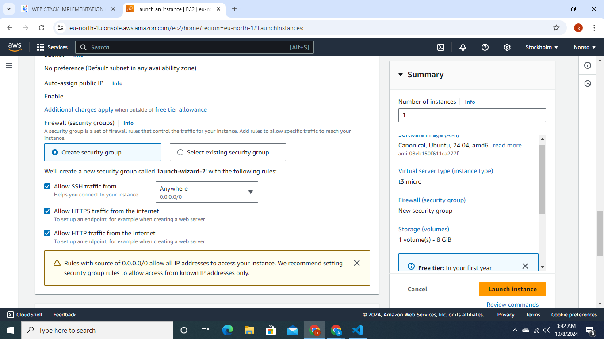
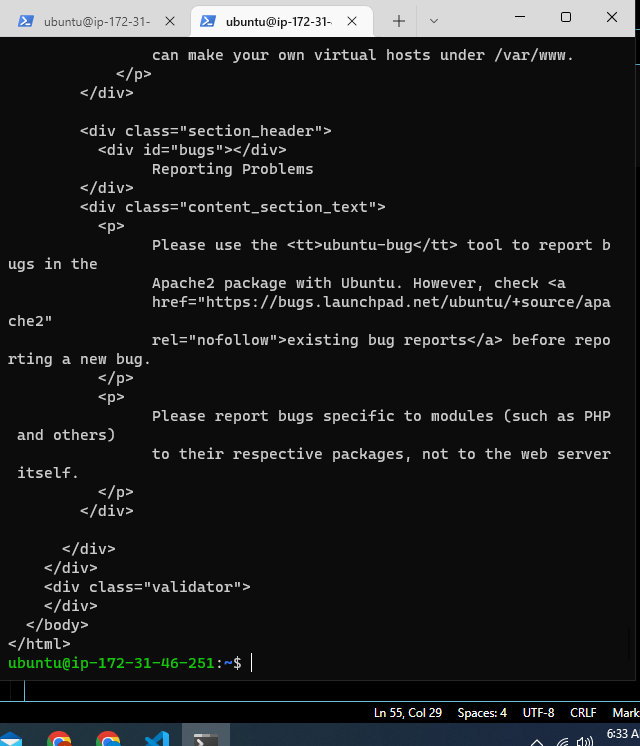

___
# THE LAMP STACK PROJECT

>The project combines four different tech stacks: 
* **Linux** 
* **Apache**
* **Mysql**
* **php**,

>in the **Deployment** of a web service on the **Amazon Web Service(aws)**

letS start with **AWS INSTANCE CREATION**

 This shows **Ec2 Dashboard** before an **INSTANCE CREATION**

* **The Instance is created  using ***Ubuntu on a t3.micro*** in Stocholm**

 this displays **Security group**  created and selected

* **Ssh is allowed in the Instance created**
* **Http connection is also allowed**
* **Https connection is allowed into the Instance**

* **I achieved this by downloading of my key pair**
* **Connect to Instance**

  * ssh -i sec.pem ubuntu@13.49.238.56
  * where sec.pem is the key pair and runs on Ubuntu linux
  * 13.449.238.56 is my public IPV4

___
## APACHE2 
* The installation comes immediately the linux has been updated using the following command
  >sudo apt update
  >sudo apt install apache2

***The confirmation to see if Apacahe2 is work up and runing***

*  **sudo systemctl status apache2** is used as command

**This Image immedately above shows apache2 is up and runinng, it has an indicator that reads ***Active(runinng)***  with a private ip in display**
* **To confirm if APACHE2 can be accessed locally on my Ubuntu machine**
> I used the command below 

**curl http://localhost:80**

* **APACHE2 IS FUNCTIONAL**

  * **YES,  IT WORKS**

  ___
  ___
## MYSQL
* **This starts with the installation of MYSQL_Server using 
***sudo apt install MYSQL-Server*** in addition to the existing server**
    

>After the installation is completed I logged into the MYSQL-Server before password is enabled

>I enabled security on my MYSQL_Server and removed all default users

>  **I finally logged in to DB using a password**

___
___
##  THE PHP
>The installation of **PHP** is the final stage of **LAMP STACK** as it is highlighted above but there is also the place of the Virtual Host. however the focus here is the php
* It starts with the installation as it is displayed below

>The installation is gently followed by the confirmation of the just concluded installation via the checking of the version for installation
this is shown here

>

___
___
## THE VIRUAL Host
* This image shows steps in which i created a **VIRTUAL HOST**

  * I created a directory where every file and folder is stored using the linux command:
    
    * mkdir

    * I named the folder- **projectlamp** which is located at **/var/www/projectlamp**
    
    * I changed Ownership also using **chown command** 
    * I enabled the The VIRTUALHOST using:  **sudo a2ensite projectlamp** while disabling the default using **a2dissite 000-default**

 * The virtual host configuration takes places  using the **VIM EDITOR**
 
 * before
  **THE TESTING COMES A RELOAD THAT BRING ALL CHANGES** using  the command below on apache2
 : **sudo systemctl reload apache2**
 
 ___
* The TESTING of Virtual Host now comes in
    *This is to confirm if the host has what is stored in it 
   * first using my instances **public IP**

  * then using **DNS**
* Results of both are displayed respectively:

___
* ENABLEMENT OF PHP
>This stage is basically to **create **PHP** file and test if PHP is properly installed and confirm that apache can properly handle a **PHP** request**

> The image below is to display the information that Operating system and PHP

>The image below confirms that **PHP** is properly installed and that Apache can handle **a PHP request**this is because a file is saved on **index.php**

>finally the PHP file is removed because info about our server, hence it displays a reversed screen.
 